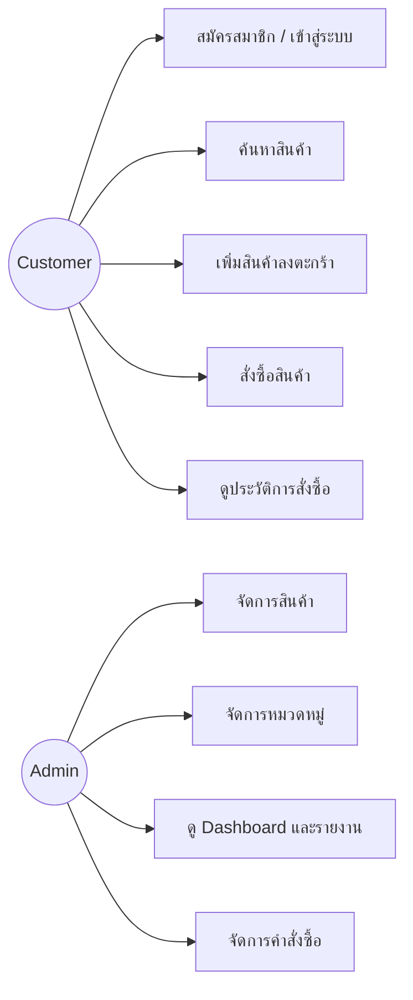
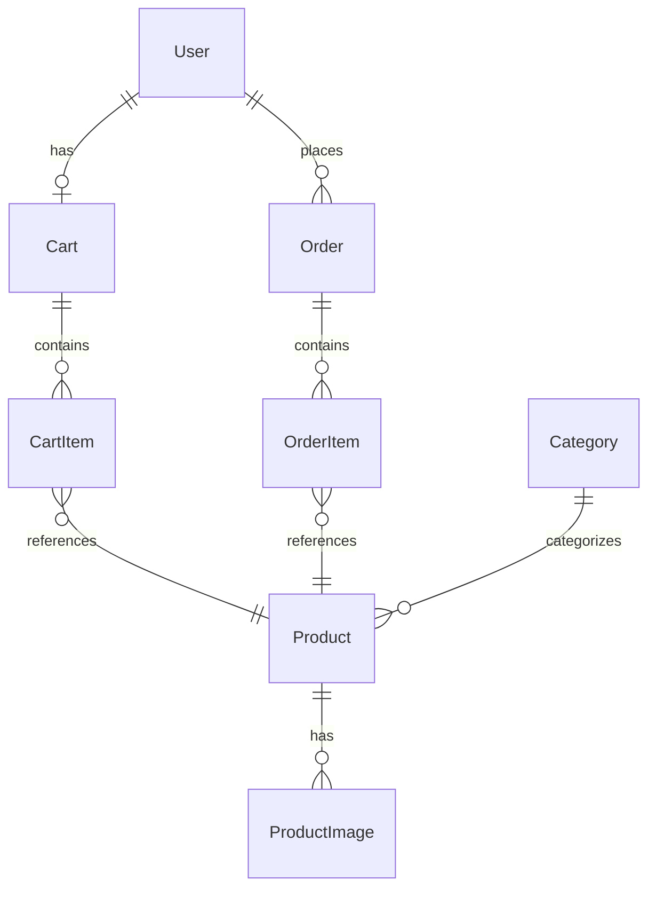

# 📊 Analysis & Design Document

**โครงงาน:** Udee — Home Decor Shop
**กลับไปหน้าหลัก:** [index.md](index.md)

---

## 1. การวิเคราะห์ความต้องการ (Requirements Analysis)

### 1.1 ความต้องการของผู้ใช้งาน (User Requirements)

ระบบมีผู้ใช้งานหลัก 2 กลุ่ม คือ **ลูกค้า (Customer)** และ **ผู้ดูแลระบบ (Admin)**

#### ลูกค้า (Customer)
- สมัครสมาชิก / เข้าสู่ระบบ
- ค้นหาและเลือกซื้อสินค้าตกแต่งบ้าน
- เพิ่มสินค้าลงตะกร้า (Cart)
- สั่งซื้อสินค้า (Checkout)
- ดูประวัติการสั่งซื้อ

#### ผู้ดูแลระบบ (Admin)
- จัดการข้อมูลสินค้า (เพิ่ม/แก้ไข/ลบ)
- จัดการหมวดหมู่สินค้า
- ดูรายงานยอดขายและคำสั่งซื้อ
- จัดการผู้ใช้งานในระบบ

### 1.2 ขอบเขตของระบบ (System Scope)

ระบบครอบคลุมฟังก์ชันหลัก 9 ส่วน ตามที่กำหนดในรายวิชา ได้แก่

1. การจัดการสมาชิก (Register / Login)
2. การจัดการข้อมูลสินค้า
3. การค้นหาและแสดงรายละเอียดสินค้า
4. ระบบตะกร้าสินค้า (Shopping Cart)
5. ระบบสั่งซื้อสินค้า (Order Management)
6. ระบบชำระเงิน (Simulation)
7. ระบบติดตามสถานะคำสั่งซื้อ
8. ระบบจัดการสินค้าและคำสั่งซื้อสำหรับผู้ดูแลระบบ
9. รายงาน / Dashboard สรุปข้อมูล

---

## 2. Use Case Diagram (เบื้องต้น)

ระบบมี Actor หลัก 2 ราย คือ **Customer** และ **Admin**

---

## 3. โครงสร้างข้อมูล (Data Model)

ระบบใช้ **MySQL** ร่วมกับ **Prisma ORM** ในการจัดการฐานข้อมูล โดยมี Entity หลักดังนี้

| Entity | คำอธิบาย |
|--------|----------|
| `User` | ข้อมูลผู้ใช้งาน (ลูกค้า/ผู้ดูแลระบบ) |
| `Category` | หมวดหมู่สินค้า |
| `Product` | ข้อมูลสินค้า |
| `ProductImage` | รูปภาพสินค้า |
| `Cart` / `CartItem` | ตะกร้าสินค้า |
| `Order` / `OrderItem` | คำสั่งซื้อและรายการสินค้าในคำสั่งซื้อ |

### ความสัมพันธ์ของข้อมูล (Entity Relationship)

---

## 4. การแบ่งงานในทีม (Work Breakdown)

| ผู้รับผิดชอบ | โมดูล | ตารางข้อมูลที่เกี่ยวข้อง |
|--------------|-------|--------------------------|
| คนที่ 1 | Authentication & User Management | `User` |
| คนที่ 2 | Product Management | `Product`, `ProductImage` |
| คนที่ 3 | Category & Search | `Category` |
| คนที่ 4 | Cart & Order | `Cart`, `CartItem`, `Order`, `OrderItem` |
| คนที่ 5 | Admin & Reports | ใช้ข้อมูลจากทุกตารางเพื่อสรุปรายงาน |

---

**ดูต่อ:** [System Architecture →](architecture.md)