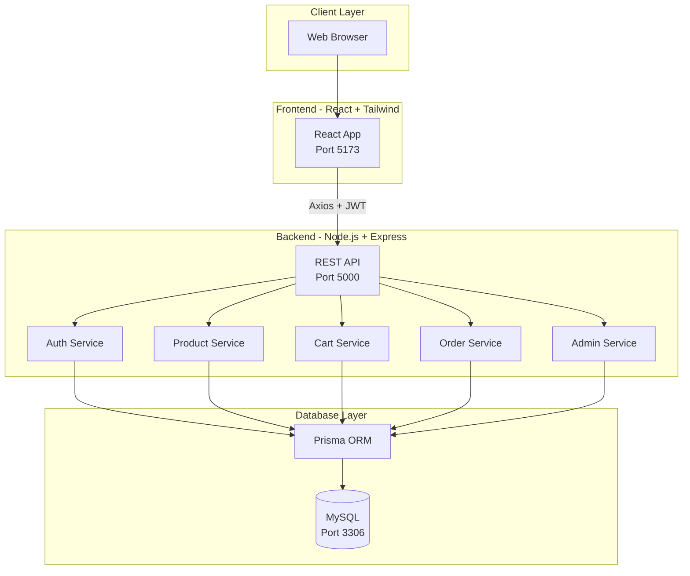
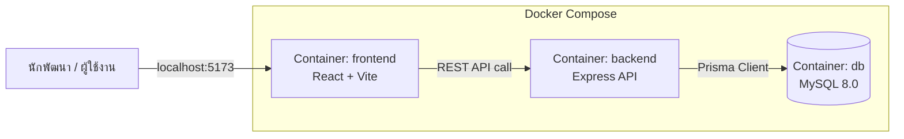

# 🏗️ System Architecture

**โครงงาน:** Udee — Home Decor Shop
**กลับไปหน้าหลัก:** [index.md](index.md)

---

## 1. ภาพรวมสถาปัตยกรรมระบบ

ระบบ Udee พัฒนาในรูปแบบ **3-Tier Architecture** ประกอบด้วย Frontend, Backend และ Database โดยรันผ่าน **Docker Compose** เพื่อให้ทุกคนในทีมสามารถพัฒนาในสภาพแวดล้อมเดียวกันได้

---

## 2. Deployment Architecture (Docker)

---

## 3. รายละเอียดสถาปัตยกรรมแต่ละชั้น (Layer Detail)

### 3.1 Frontend Layer
- **Framework:** React (Vite)
- **Styling:** Tailwind CSS
- **HTTP Client:** Axios (พร้อม JWT Interceptor)
- **Routing:** React Router
- หน้าที่: แสดงผล UI, จัดการ State ฝั่ง Client, เรียก API ไปยัง Backend

### 3.2 Backend Layer
- **Framework:** Express.js
- **Authentication:** JWT (JSON Web Token) + bcrypt
- **File Upload:** Multer
- หน้าที่: ประมวลผล Business Logic, ตรวจสอบสิทธิ์ผู้ใช้งาน, เชื่อมต่อฐานข้อมูล

### 3.3 Database Layer
- **Database:** MySQL 8.0
- **ORM:** Prisma (จัดการ Schema และ Query)
- หน้าที่: จัดเก็บข้อมูลผู้ใช้ สินค้า คำสั่งซื้อ และข้อมูลอื่น ๆ ของระบบ

---

## 4. เหตุผลในการเลือกใช้สถาปัตยกรรมนี้

| ปัจจัย | เหตุผล |
|--------|--------|
| **Separation of Concerns** | แยก Frontend และ Backend ออกจากกันชัดเจน ทำให้พัฒนาคู่ขนานกันได้ |
| **Scalability** | สามารถขยายแต่ละ Service ใน Backend ไปเป็น Microservices ได้ในอนาคต |
| **Maintainability** | ใช้ Prisma ORM ทำให้จัดการ Database Schema เป็นระบบ ลดข้อผิดพลาด |
| **Team Collaboration** | ใช้ Docker Compose ทำให้สมาชิกทุกคนรันระบบได้เหมือนกันทุกเครื่อง |

---

**ดูเพิ่มเติม:** [Analysis & Design ←](analysis-design.md) | [กลับหน้าหลัก](index.md)